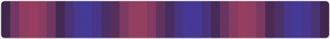
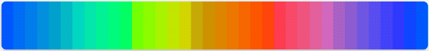
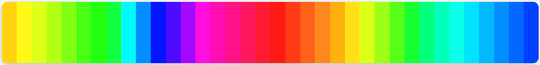
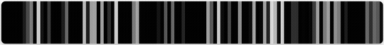
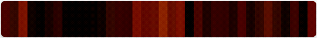
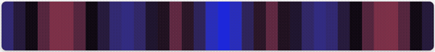
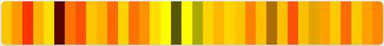
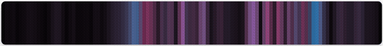
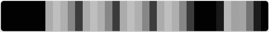
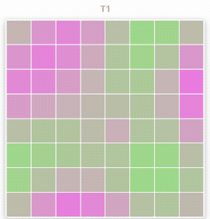

# Getting Started with Light Effects

The Light Effects Framework provides a comprehensive system for creating and managing visual effects on LIFX devices. This guide will help you get started with the built-in effects and show you common patterns for using the effects system.

## Overview

The effects framework consists of three main components:

- **Conductor**: Central orchestrator that manages effect lifecycle and state
- **Effects**: Pre-built effect classes (Pulse, ColorLoop, Rainbow, Flame, Aurora, Progress, Sunrise/Sunset) and base class for custom effects
- **Effect Registry**: Central discovery mechanism for querying available effects by device type
- **State Management**: Automatic capture and restoration of device state before and after effects

## Installation

The effects framework is included with lifx-async 1.3.0+. No additional installation is required:

```bash
# Using uv (recommended)
uv pip install lifx-async

# Or using pip
pip install lifx-async
```

## Basic Usage

### Your First Pulse Effect

The simplest way to use the effects framework is with the `EffectPulse` class:

```python
import asyncio
from lifx import discover, DeviceGroup
from lifx.effects import Conductor, EffectPulse

async def main():
    # Discover lights on your network
    devices = []
    async for device in discover():
        devices.append(device)
    group = DeviceGroup(devices)

    if not group.lights:
        print("No lights found")
        return

    # Create a conductor to manage effects
    conductor = Conductor()

    # Create a blink effect
    effect = EffectPulse(mode='blink', cycles=5)

    # Start the effect on all lights
    await conductor.start(effect, group.lights)

    # Wait for effect to complete (5 cycles * 1 second)
    await asyncio.sleep(6)

    print("Effect complete - lights restored to original state")

asyncio.run(main())
```

### Your First ColorLoop Effect

The `EffectColorloop` creates a continuous rainbow effect:

```python
import asyncio
from lifx import discover, DeviceGroup
from lifx.effects import Conductor, EffectColorloop

async def main():
    devices = []
    async for device in discover():
        devices.append(device)
    group = DeviceGroup(devices)

    if not group.lights:
        print("No lights found")
        return

    conductor = Conductor()

        # Create a rainbow effect
        effect = EffectColorloop(
            period=30,      # 30 seconds per full cycle
            change=20,      # Change hue by 20 degrees each step
            spread=60       # Spread colors across devices
        )

        # Start the effect
        await conductor.start(effect, group.lights)

        # Let it run for 2 minutes
        await asyncio.sleep(120)

        # Stop and restore lights to original state
        await conductor.stop(group.lights)

asyncio.run(main())
```

### Rainbow Effect

The `EffectRainbow` spreads a full 360-degree rainbow across device pixels and scrolls it over time. Best on multizone strips and matrix lights:

```python
import asyncio
from lifx import discover, DeviceGroup
from lifx.effects import Conductor, EffectRainbow

async def main():
    devices = []
    async for device in discover():
        devices.append(device)
    group = DeviceGroup(devices)

    if not group.lights:
        print("No lights found")
        return

    conductor = Conductor()

    # Rainbow that scrolls every 10 seconds
    effect = EffectRainbow(period=10, brightness=0.8)
    await conductor.start(effect, group.lights)

    await asyncio.sleep(30)
    await conductor.stop(group.lights)

asyncio.run(main())
```

### Flame Effect

The `EffectFlame` creates a warm fire/candle flicker using layered sine waves. On matrix devices, bottom rows glow hotter:

```python
from lifx.effects import EffectFlame

# Default candle flicker
effect = EffectFlame()
await conductor.start(effect, lights)

# Intense fast fire with wide temperature range
effect = EffectFlame(intensity=1.0, speed=2.0, brightness=1.0)
await conductor.start(effect, lights)

await asyncio.sleep(30)
await conductor.stop(lights)
```

### Aurora Effect

The `EffectAurora` simulates northern lights with flowing colored bands. Best on multizone strips and matrix lights:

```python
from lifx.effects import EffectAurora

# Default aurora (green/cyan/blue/purple)
effect = EffectAurora()
await conductor.start(effect, lights)

# Custom warm palette
effect = EffectAurora(palette=[280, 300, 320, 340], brightness=0.6)
await conductor.start(effect, lights)

await asyncio.sleep(60)
await conductor.stop(lights)
```

### Progress Bar Effect

The `EffectProgress` creates an animated progress bar on multizone lights (strips/beams). The filled region has a traveling bright spot, and you update the position at any time:

```python
from lifx.effects import EffectProgress

effect = EffectProgress(end_value=100)
await conductor.start(effect, [strip_light])

# Update progress from your application logic
for i in range(0, 101, 10):
    effect.position = float(i)
    await asyncio.sleep(2)

await conductor.stop([strip_light])
```

### Sunrise and Sunset Effects

`EffectSunrise` and `EffectSunset` are duration-based effects for matrix devices (tiles, candles, Ceiling lights) that simulate natural light transitions:

```python
from lifx.effects import EffectSunrise, EffectSunset

# 30-minute sunrise from bottom edge (rectangular tiles)
effect = EffectSunrise(duration=1800, brightness=1.0)
await conductor.start(effect, [matrix_light])

# Sunrise from center (round/oval Ceiling lights)
effect = EffectSunrise(duration=1800, brightness=1.0, origin="center")
await conductor.start(effect, [ceiling_light])

# Sunset that powers off when done
effect = EffectSunset(duration=1800, power_off=True)
await conductor.start(effect, [matrix_light])
```

Sunrise and sunset effects complete automatically after their duration — no need to call `conductor.stop()`. Sunrise leaves the light at full daylight. Sunset can optionally power off the light.

## Key Concepts

### Conductor

The `Conductor` is the central orchestrator that:

- Captures device state before effects run
- Powers on devices if needed
- Executes effects
- Restores devices to original state when done

You typically create one conductor instance and reuse it for multiple effects.

### Effect State Management

The effects framework automatically:

1. **Captures** current state (power, color, zones) before effect starts
2. **Powers on** devices if they're off (configurable)
3. **Executes** the effect
4. **Restores** all devices to their pre-effect state

This happens completely automatically - you don't need to manage state yourself.

### Effect Completion

Effects complete in different ways:

1. **Cycle-based** — Pulse effects complete after their configured cycles finish
2. **Duration-based** — Sunrise and sunset effects complete after their duration expires
3. **Manual** — Continuous effects (ColorLoop, Rainbow, Flame, Aurora, Progress) run until `conductor.stop()` is called

## Common Patterns

### Using Specific Lights

You can apply effects to specific lights instead of all discovered devices:

```python
from lifx import discover, DeviceGroup

devices = []
async for device in discover():
    devices.append(device)
group = DeviceGroup(devices)

conductor = Conductor()

# Get lights by label
bedroom_lights = [
    light for light in group.lights
    if "Bedroom" in await light.get_label()
]

# Apply effect only to bedroom lights
effect = EffectPulse(mode='breathe', cycles=3)
await conductor.start(effect, bedroom_lights)
await asyncio.sleep(4)
```

### Sequential Effects

You can run multiple effects one after another:

```python
conductor = Conductor()

# First effect: blink
effect1 = EffectPulse(mode='blink', cycles=3)
await conductor.start(effect1, group.lights)
await asyncio.sleep(4)

# Second effect: breathe
effect2 = EffectPulse(mode='breathe', cycles=2)
await conductor.start(effect2, group.lights)
await asyncio.sleep(5)
```

Note: The conductor automatically restores state between effects, so each effect starts with the original device state.

### Concurrent Effects on Different Devices

You can run different effects on different groups of lights simultaneously:

```python
conductor = Conductor()

# Split lights into two groups
group1 = group.lights[:len(group.lights)//2]
group2 = group.lights[len(group.lights)//2:]

# Start both effects concurrently
effect1 = EffectPulse(mode='blink')
effect2 = EffectColorloop(period=20)

await conductor.start(effect1, group1)
await conductor.start(effect2, group2)

# Let them run
await asyncio.sleep(30)

# Stop all
await conductor.stop(group.lights)
```

### Custom Colors

Both pulse and colorloop effects support custom colors:

```python
from lifx import HSBK

# Create custom color
red = HSBK.from_rgb(255, 0, 0)
blue = HSBK.from_rgb(0, 0, 255)

# Pulse with custom color
effect = EffectPulse(mode='breathe', cycles=5, color=red)
await conductor.start(effect, group.lights)
await asyncio.sleep(6)
```

### Checking Running Effects

You can check what effect is currently running on a device:

```python
conductor = Conductor()
effect = EffectColorloop(period=30)
await conductor.start(effect, group.lights)

# Check what's running
for light in group.lights:
    current = conductor.effect(light)
    if current:
        print(f"{light.label}: {type(current).__name__}")
    else:
        print(f"{light.label}: idle")
```

### Effect Registry

The `EffectRegistry` lets you discover available effects and filter by device type — useful for building UIs or integrations like Home Assistant:

```python
from lifx import get_effect_registry, DeviceType

registry = get_effect_registry()

# List all built-in effects
for info in registry.effects:
    print(f"{info.name}: {info.description}")

# Get effects recommended for multizone strips
for info, support in registry.get_effects_for_device_type(DeviceType.MULTIZONE):
    print(f"{info.name} ({support.value})")

# Filter by actual device instance
for info, support in registry.get_effects_for_device(my_light):
    print(f"{info.name}: {support.value}")
```

### Dynamic Light Management

You can add or remove lights from a running effect without restarting it:

```python
# Start effect on initial lights
effect = EffectRainbow(period=10)
await conductor.start(effect, [light1, light2])

# Later, add a new light to the running effect
await conductor.add_lights(effect, [light3])

# Remove a light (restores its state by default)
await conductor.remove_lights([light2])

# Remove without restoring state
await conductor.remove_lights([light1], restore_state=False)
```

### Monitoring Frame Data

For frame-based effects, you can read the most recent HSBK values sent to a device:

```python
colors = conductor.get_last_frame(light)
if colors:
    avg_brightness = sum(c.brightness for c in colors) / len(colors)
    print(f"Average brightness: {avg_brightness:.1%}")
```

## Best Practices

### 1. Use a Single Conductor

Create one conductor instance and reuse it throughout your application:

```python
# Good
conductor = Conductor()
await conductor.start(effect1, lights)
await conductor.start(effect2, lights)

# Not recommended - creates unnecessary overhead
conductor1 = Conductor()
await conductor1.start(effect1, lights)
conductor2 = Conductor()
await conductor2.start(effect2, lights)
```

### 2. Always Wait for Completion

For pulse effects, wait for the effect duration before starting another:

```python
effect = EffectPulse(mode='blink', period=1.0, cycles=5)
await conductor.start(effect, lights)
# Wait for effect to complete
await asyncio.sleep(5 * 1.0 + 0.5)  # cycles * period + buffer
```

### 3. Stop ColorLoop Effects Explicitly

ColorLoop effects run indefinitely, so always call `conductor.stop()`:

```python
effect = EffectColorloop(period=30)
await conductor.start(effect, lights)
await asyncio.sleep(60)
# Must explicitly stop
await conductor.stop(lights)
```

### 4. Handle Discovery Failures

Always check if lights were found before attempting effects:

```python
from lifx import discover, DeviceGroup

devices = []
async for device in discover():
    devices.append(device)
group = DeviceGroup(devices)

if not group.lights:
    print("No lights found on network")
    return

# Safe to use effects
conductor = Conductor()
# ...
```

### 5. Use DeviceGroup for Organization

The DeviceGroup provides convenient access to device collections:

```python
from lifx import discover, DeviceGroup

# Discover devices
devices = []
async for device in discover():
    devices.append(device)
group = DeviceGroup(devices)

conductor = Conductor()
await conductor.start(effect, group.lights)
```

## Complete Examples

### Notification Effect

Use effects to create a notification system:

```python
async def notify(lights: list, level: str = 'info'):
    """Flash lights to indicate a notification."""
    conductor = Conductor()

    if level == 'info':
        # Blue breathe
        color = HSBK.from_rgb(0, 0, 255)
        effect = EffectPulse(mode='breathe', cycles=2, color=color)
    elif level == 'warning':
        # Orange blink
        color = HSBK.from_rgb(255, 165, 0)
        effect = EffectPulse(mode='blink', cycles=3, color=color)
    elif level == 'error':
        # Red strobe
        color = HSBK.from_rgb(255, 0, 0)
        effect = EffectPulse(mode='strobe', cycles=10, color=color)

    await conductor.start(effect, lights)
    await asyncio.sleep(4)  # Wait for completion

# Usage
from lifx import discover, DeviceGroup

devices = []
async for device in discover():
    devices.append(device)
group = DeviceGroup(devices)

await notify(group.lights, level='warning')
```

### Party Mode

Cycle through different effects:

```python
async def party_mode(lights: list, duration: int = 60):
    """Run various effects for a party."""
    conductor = Conductor()
    end_time = asyncio.get_event_loop().time() + duration

    effects = [
        EffectColorloop(period=20, change=30, spread=60),
        EffectPulse(mode='strobe', cycles=20),
        EffectColorloop(period=15, change=45, brightness=0.8),
    ]

    effect_idx = 0
    while asyncio.get_event_loop().time() < end_time:
        effect = effects[effect_idx % len(effects)]

        if isinstance(effect, EffectColorloop):
            await conductor.start(effect, lights)
            await asyncio.sleep(20)
            await conductor.stop(lights)
        else:
            await conductor.start(effect, lights)
            await asyncio.sleep(3)

        effect_idx += 1

    # Ensure everything is stopped and restored
    await conductor.stop(lights)

# Usage
from lifx import discover, DeviceGroup

devices = []
async for device in discover():
    devices.append(device)
group = DeviceGroup(devices)

await party_mode(group.lights, duration=120)
```

## More Effects

In addition to the effects above, lifx-async includes 18 effects adapted from [pkivolowitz/lifx](https://github.com/pkivolowitz/lifx) by Perry Kivolowitz. They use the same Conductor and FrameEffect infrastructure and run indefinitely until stopped.

### Cylon


Larson scanner — a bright eye sweeps back and forth with a fading trail. Classic Knight Rider look.

```python
from lifx.effects import EffectCylon

# Default scanner
effect = EffectCylon()
await conductor.start(effect, lights)

# Faster red scanner with wider eye
effect = EffectCylon(speed=1.0, width=5, hue=0, trail=0.7)
await conductor.start(effect, lights)

await asyncio.sleep(30)
await conductor.stop(lights)
```

**Key parameters:** `speed` (seconds per sweep), `width` (eye width in bulbs), `hue`, `trail` (decay factor 0-1)

### Wave



Standing wave — zones vibrate between two colors with stationary nodes. Adjacent segments swing in opposite directions.

```python
from lifx.effects import EffectWave

# Two-node standing wave
effect = EffectWave(nodes=2, hue1=0, hue2=240)
await conductor.start(effect, lights)

# Drifting wave (not purely standing)
effect = EffectWave(nodes=3, drift=10.0, speed=6.0)
await conductor.start(effect, lights)
```

**Key parameters:** `speed` (oscillation period), `nodes` (stationary points), `hue1`/`hue2`, `drift` (spatial drift degrees/s)

### Sine


Smooth ease-wave — bright humps roll along the strip using cubic smoothstep. Optional two-color gradient.

```python
from lifx.effects import EffectSine

# Blue wave
effect = EffectSine(hue=200, wavelength=0.5, speed=4.0)
await conductor.start(effect, lights)

# Two-color gradient wave
effect = EffectSine(hue=0, hue2=240, wavelength=0.3)
await conductor.start(effect, lights)
```

**Key parameters:** `speed`, `wavelength` (fraction of strip), `hue`, `hue2` (optional gradient), `floor` (min brightness)

### Spectrum Sweep



Three sine waves 120° out of phase sweep through zones like a spectrum analyzer. Red, green, and blue channels blend via Oklab interpolation.

```python
from lifx.effects import EffectSpectrumSweep

effect = EffectSpectrumSweep(speed=6.0, waves=1.0)
await conductor.start(effect, lights)
```

**Key parameters:** `speed` (sweep period), `waves` (number of wave periods across strip)

### Spin



Rotates theme colors through zones with smooth Oklab interpolation and per-zone hue shimmer.

```python
from lifx.effects import EffectSpin

# Default spin with built-in theme
effect = EffectSpin(speed=10.0)
await conductor.start(effect, lights)
```

**Key parameters:** `speed` (rotation period), `bulb_offset` (per-zone hue shift for shimmer)

### Twinkle



Random pixels sparkle and fade like Christmas lights. Each spark has a fast flash and slow quadratic decay tail.

```python
from lifx.effects import EffectTwinkle

# White sparkles on dark background
effect = EffectTwinkle(density=0.05, speed=1.0)
await conductor.start(effect, lights)

# Colored sparkles
effect = EffectTwinkle(hue=120, saturation=1.0, density=0.1)
await conductor.start(effect, lights)
```

**Key parameters:** `speed` (fade duration), `density` (sparkle probability per frame), `hue`, `saturation`

### Embers



Fire simulation via 1D heat diffusion — heat injected at the bottom, diffuses upward with cooling and turbulence.

```python
from lifx.effects import EffectEmbers

effect = EffectEmbers(intensity=0.5, cooling=0.15, turbulence=0.3)
await conductor.start(effect, lights)
```

**Key parameters:** `intensity` (heat injection probability), `cooling`, `turbulence`

### Plasma


Plasma ball — bright core pulsing at center with electric tendrils crackling outward. Tendrils random-walk and fork.

```python
from lifx.effects import EffectPlasma

# Default violet plasma
effect = EffectPlasma()
await conductor.start(effect, lights)

# Green plasma with frequent tendrils
effect = EffectPlasma(hue=120, tendril_rate=1.0, hue_spread=30.0)
await conductor.start(effect, lights)
```

**Key parameters:** `speed` (core pulse period), `tendril_rate`, `hue`, `hue_spread`

### Pendulum Wave


Pendulums with linearly varying periods drift in and out of phase, creating traveling waves, standing waves, and chaos before realigning.

```python
from lifx.effects import EffectPendulumWave

effect = EffectPendulumWave(speed=30.0, cycles=8, hue1=0, hue2=240)
await conductor.start(effect, lights)
```

**Key parameters:** `speed` (realignment cycle), `cycles` (oscillations per cycle), `hue1`/`hue2`

### Double Slit



Young's double slit interference — two coherent wave sources create constructive/destructive interference fringes that shift as wavelength breathes.

```python
from lifx.effects import EffectDoubleSlit

effect = EffectDoubleSlit(wavelength=0.3, separation=0.2, breathe=8.0)
await conductor.start(effect, lights)
```

**Key parameters:** `speed`, `wavelength`, `separation`, `breathe` (wavelength modulation period; 0 = off)

### Rule 30


Wolfram's Rule 30 cellular automaton — generates chaotic/pseudo-random patterns. Configurable seed modes: center, random, or all.

```python
from lifx.effects import EffectRule30

# Classic Rule 30
effect = EffectRule30(rule=30, speed=5.0, seed="center")
await conductor.start(effect, lights)

# Rule 110 (Turing-complete!)
effect = EffectRule30(rule=110, hue=0, seed="random")
await conductor.start(effect, lights)
```

**Key parameters:** `rule` (Wolfram rule 0-255), `speed` (generations/s), `seed` ("center"/"random"/"all"), `hue`

### Rule Trio



Three independent cellular automata running at irrational speed ratios, blended via Oklab. Produces evolving color interference patterns.

```python
from lifx.effects import EffectRuleTrio

effect = EffectRuleTrio(rule_a=30, rule_b=90, rule_c=110, speed=5.0)
await conductor.start(effect, lights)
```

**Key parameters:** `rule_a`/`rule_b`/`rule_c`, `speed`, `drift_b`/`drift_c` (speed multipliers)

### Fireworks


Rockets launch from both ends, ascend with easing, and burst into expanding gaussian halos. Color evolves from white through chemical colors to orange.

```python
from lifx.effects import EffectFireworks

effect = EffectFireworks(max_rockets=3, launch_rate=0.5, burst_spread=5.0)
await conductor.start(effect, lights)
```

**Key parameters:** `max_rockets`, `launch_rate`, `ascent_speed`, `burst_spread`, `burst_duration`

### Ripple



Ripple tank — raindrops hit a water surface, launching wavefronts that propagate, reflect, and interfere. Displacement maps to color via Oklab.

```python
from lifx.effects import EffectRipple

effect = EffectRipple(speed=1.0, damping=0.98, drop_rate=0.3)
await conductor.start(effect, lights)
```

**Key parameters:** `speed`, `damping`, `drop_rate`, `hue1`/`hue2`

### Jacob's Ladder


Electric arcs drift along the strip with flickering, crackling spikes, and electrode glows. Inspired by Frankenstein lab props.

```python
from lifx.effects import EffectJacobsLadder

effect = EffectJacobsLadder(speed=0.5, arcs=2, gap=5)
await conductor.start(effect, lights)
```

**Key parameters:** `speed` (arc drift speed), `arcs` (simultaneous arc pairs), `gap` (electrode spacing)

### Newton's Cradle



Newton's cradle momentum transfer — steel balls swing alternately with Phong sphere shading and specular highlights.

```python
from lifx.effects import EffectNewtonsCradle

effect = EffectNewtonsCradle(num_balls=5, speed=2.0)
await conductor.start(effect, lights)
```

**Key parameters:** `num_balls`, `speed` (cycle period), `shininess` (Phong exponent), `hue`, `saturation`

### Sonar


Sonar/radar pulses bounce off drifting obstacles. Wavefronts emit from sources, reflect off obstacles, and decay with tails.

```python
from lifx.effects import EffectSonar

effect = EffectSonar(speed=8.0, pulse_interval=2.0, obstacle_speed=0.5)
await conductor.start(effect, lights)
```

**Key parameters:** `speed` (wavefront speed), `pulse_interval`, `obstacle_speed`, `decay`

### Plasma 2D



2D plasma effect — four sine waves (horizontal, vertical, diagonal, radial) create flowing interference color patterns. Matrix devices only.

```python
from lifx.effects import EffectPlasma2D

effect = EffectPlasma2D(speed=1.0, scale=1.0, hue1=270, hue2=180)
await conductor.start(effect, [matrix_light])
```

**Key parameters:** `speed` (animation speed), `scale` (spatial scale), `hue1`/`hue2`

### Device Compatibility Reference

| Effect | Light | MultiZone | Matrix |
|--------|-------|-----------|--------|
| cylon | COMPATIBLE | RECOMMENDED | — |
| wave | COMPATIBLE | RECOMMENDED | — |
| sine | COMPATIBLE | RECOMMENDED | — |
| spectrum_sweep | COMPATIBLE | RECOMMENDED | — |
| spin | COMPATIBLE | RECOMMENDED | — |
| twinkle | RECOMMENDED | RECOMMENDED | COMPATIBLE |
| embers | COMPATIBLE | RECOMMENDED | — |
| plasma | COMPATIBLE | RECOMMENDED | — |
| pendulum_wave | — | RECOMMENDED | — |
| double_slit | — | RECOMMENDED | — |
| rule30 | — | RECOMMENDED | — |
| rule_trio | — | RECOMMENDED | — |
| fireworks | — | RECOMMENDED | — |
| ripple | — | RECOMMENDED | — |
| jacobs_ladder | — | RECOMMENDED | — |
| newtons_cradle | — | RECOMMENDED | — |
| sonar | — | RECOMMENDED | — |
| plasma2d | — | — | RECOMMENDED |

All ported effects run indefinitely until stopped via `conductor.stop()`.

## Next Steps

- See [Effects Reference](../api/effects.md) for detailed documentation on all effect parameters
- See [Custom Effects](../user-guide/effects-custom.md) to learn how to create your own effects
- See [Effects Architecture](../architecture/effects-architecture.md) to understand how the system works internally
- See [Troubleshooting](../user-guide/effects-troubleshooting.md) for common issues and solutions
