# Effects Gallery

Animated previews of all effects available in lifx-async, captured from the [LIFX Emulator](https://github.com/Djelibeybi/lifx-emulator) dashboard. Effects adapted from [pkivolowitz/lifx](https://github.com/pkivolowitz/lifx) by Perry Kivolowitz are noted below.

## Multizone Effects

These effects are designed for LED strips and beams. Most also work on single-bulb lights.

-   ### Aurora

    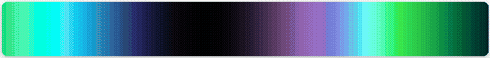

    Flowing northern lights with palette interpolation and sine waves.

    **Class:** `EffectAurora` · **Best on:** Multizone, Matrix

-   ### Colorloop

    

    Continuous hue rotation through the colour spectrum, or through your own `palette=`.

    **Class:** `EffectColorloop` · **Best on:** Light

-   ### Cylon

    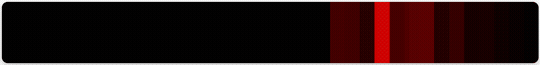

    Larson scanner — bright eye sweeps back and forth with fading trail.

    **Class:** `EffectCylon` · **Best on:** Multizone

-   ### Double Slit

    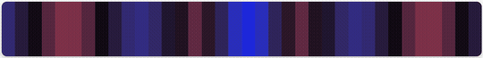

    Young's double slit interference with shifting fringe patterns.

    **Class:** `EffectDoubleSlit` · **Best on:** Multizone, Mirror (`seamless` option)

-   ### Embers

    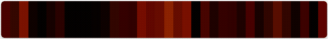

    1D heat diffusion — rising embers with cooling and turbulence.

    **Class:** `EffectEmbers` · **Best on:** Multizone, Mirror (seamless on the ring)

-   ### Fireworks

    

    Rockets launch, ascend, and burst into expanding color halos.

    **Class:** `EffectFireworks` · **Best on:** Multizone, Mirror (seamless on the ring)

-   ### Flicker

    

    Fire/candle flicker with layered sine waves and warm colors. Renamed from `EffectFlame`,
    which remains as a deprecated alias.

    **Class:** `EffectFlicker` · **Best on:** Light, Multizone, Matrix

-   ### Jacob's Ladder

    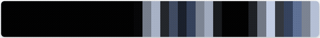

    Electric arcs drift along the strip with flickering and crackling.

    **Class:** `EffectJacobsLadder` · **Best on:** Multizone, Mirror (seam at the ring origin)

-   ### Newton's Cradle

    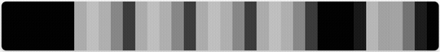

    Steel balls swing alternately with Phong sphere shading.

    **Class:** `EffectNewtonsCradle` · **Best on:** Multizone, Mirror (seam at the ring origin)

-   ### Pendulum Wave

    

    Pendulums with varying periods drift in and out of phase.

    **Class:** `EffectPendulumWave` · **Best on:** Multizone, Mirror (`seamless` option)

-   ### Plasma

    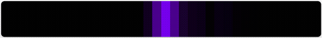

    Plasma ball — electric tendrils crackle from a pulsing core.

    **Class:** `EffectPlasma` · **Best on:** Multizone, Mirror (seamless on the ring)

-   ### Progress

    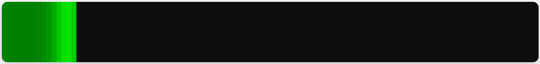

    Animated progress bar with traveling bright spot.

    **Class:** `EffectProgress` · **Best on:** Multizone, Mirror (seam at the ring origin)

-   ### Rainbow

    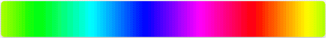

    Full 360° rainbow spread across pixels, scrolling over time.

    **Class:** `EffectRainbow` · **Best on:** Multizone, Matrix

-   ### Ripple

    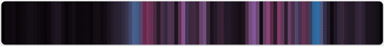

    Raindrops on water — wavefronts propagate, reflect, and interfere.

    **Class:** `EffectRipple` · **Best on:** Multizone, Mirror (seamless on the ring)

-   ### Rule 30

    

    Wolfram's Rule 30 cellular automaton — chaotic organic patterns.

    **Class:** `EffectRule30` · **Best on:** Multizone, Mirror (seamless on the ring)

-   ### Rule Trio

    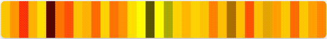

    Three cellular automata at irrational speed ratios, blended via Oklab.

    **Class:** `EffectRuleTrio` · **Best on:** Multizone, Mirror (seamless on the ring)

-   ### Sine

    

    Traveling ease wave — bright humps roll with smooth cubic transitions.

    **Class:** `EffectSine` · **Best on:** Multizone

-   ### Sonar

    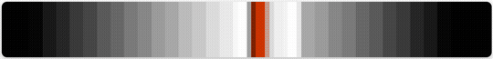

    Sonar pulses bounce off drifting obstacles with decay tails.

    **Class:** `EffectSonar` · **Best on:** Multizone, Mirror (seam at the ring origin)

-   ### Spectrum Sweep

    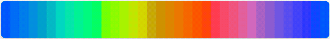

    Three sine waves 120° out of phase sweep through zones like a spectrum analyzer.

    **Class:** `EffectSpectrumSweep` · **Best on:** Multizone

-   ### Spin

    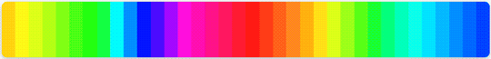

    Theme colors rotate through zones with Oklab interpolation.

    **Class:** `EffectSpin` · **Best on:** Multizone

-   ### Twinkle

    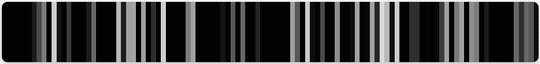

    Random pixels sparkle and fade like Christmas lights.

    **Class:** `EffectTwinkle` · **Best on:** Light, Multizone

-   ### Wave

    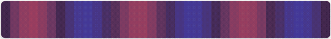

    Standing wave — zones vibrate between two colors with fixed nodes.

    **Class:** `EffectWave` · **Best on:** Multizone

## Matrix Effects

These effects are designed for LIFX Tile, Candle, and Ceiling devices.

-   ### Plasma 2D (single tile)

    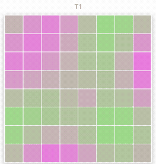

    2D plasma — four sine waves create flowing interference patterns.

    **Class:** `EffectPlasma2D` · **Best on:** Matrix

-   ### Plasma 2D (5-tile canvas)

    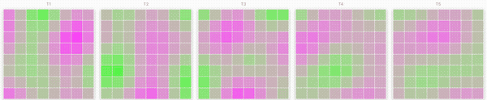

    Same effect spanning a 40×8 multi-tile canvas — each tile shows a different part of the continuous pattern.

    **Class:** `EffectPlasma2D` · **Best on:** Matrix

-   ### Scroll

    Moves a painted image one column every 1.25 seconds, as the LIFX app does for a MOVE mood. Pass `vertical=True` to move whole rows down the light instead.

    **Class:** `EffectScroll` · **Best on:** Matrix (not the Mirror)

---

See [Light Effects](effects.md) for usage examples and code, or [Effects Reference](../api/effects.md) for full API documentation.
